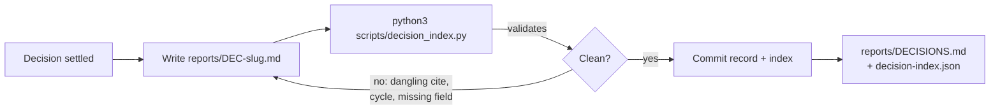

<!-- Cruxton — public README draft. Replace <your-github> throughout, confirm the license line,
     and swap the example record for whichever reports/DEC-*.md reads best. Non-destructive: this is
     README.DRAFT.md; promote to README.md when you're happy with it. -->

<div align="center">

# 🪨 Cruxton

**A portable decision-records system your whole agent stack obeys.**

A durable, validated trail of *what was decided, why, what was rejected, and the human reasoning a
machine can't re-derive* — so agents stop drifting and humans can reconstruct every call.

[](LICENSE)
[](https://github.com/<your-github>/cruxton/actions)


**Works with** Claude Code · claude.ai · Codex · Cursor · Gemini CLI · Copilot · ChatGPT

</div>

---

## The problem

Point three different agents at the same repo and they will happily re-open a question you settled last
week, wander down a path that already failed, and re-research a decision from scratch — because the
*reasoning* lived in a chat that no longer exists. Git tells you **what** changed; it never tells you
**why**, what you rejected, or the instinct that actually drove the call. When the conversation ends,
that reasoning is gone.

## What Cruxton is

A small, tool-agnostic method that lives in your repo as plain Markdown records plus **one
dependency-free Python validator**. Each record captures what a machine *can* re-derive (the logic) and,
more importantly, what it **can't** — a person's instinct, a read on the field, an org constraint. A
generator turns the records into a human-readable ledger and a machine-readable index, and **fails the
build** on a broken one.

It's built on **pace layering**: every fact lives at the layer that matches how fast it changes, and
faster layers cite slower ones instead of restating them.

```
purpose      the reason to exist              changes ~never
principles   invariants you never violate      constitutional
decisions    ← Cruxton lives here              append-mostly
runbooks     how to do a task today            changes with tooling
code         the implementation                every commit
```

## Two audiences, one file

- **Agents** — read the principles first, grep the trail before proposing anything, never reopen a
  settled call, and cite what they touch so contradictions surface as edges instead of silent drift.
- **Humans** — read `reports/DECISIONS.md` to see how everything was decided, or point Claude / ChatGPT
  at it and just *ask*.

The same `instructions/DECISION-RECORDS.md` binds every tool — no per-agent forks to keep in sync.

---

## Install

Pick your tool. Every path ends the same way: a `SELF-CHECK PASSED` line proving the setup is live.

<details open>
<summary><b>Claude Code</b> (plugin — one command)</summary>

```
/plugin marketplace add <your-github>/cruxton
/plugin install cruxton-decision-records@cruxton
```
Then, in any repo you want to instrument, ask Claude to *"set up decision records here"* — the skill
runs the bootstrap from its bundled location (`${CLAUDE_PLUGIN_ROOT}`). To bootstrap manually instead,
use the clone path shown below.
</details>

<details>
<summary><b>Codex</b> (skill — one command)</summary>

Inside Codex, install the skill straight from this repo with the built-in skill-installer:
```
$skill-installer install https://github.com/<your-github>/cruxton/tree/main/skills/cruxton-decision-records
```
Skills install to `~/.codex/skills/` (`$CODEX_HOME/skills`); **restart Codex** to pick it up. Then, in
any repo, ask Codex to *"set up decision records here"* — it runs the bundled bootstrap. (Codex also
reads the `AGENTS.md` pointer that bootstrap writes, so it obeys an already-instrumented repo without
installing anything — see the AGENTS.md path below.)
</details>

<details>
<summary><b>Cursor · Gemini CLI · Copilot · Windsurf · other AGENTS.md tools</b></summary>

```
git clone https://github.com/<your-github>/cruxton
python3 cruxton/skills/cruxton-decision-records/bootstrap.py /path/to/your/repo
```
Bootstrap writes an `AGENTS.md` pointer (and a `CLAUDE.md` one), so your agent picks up the protocol
automatically on the next session.
</details>

<details>
<summary><b>claude.ai</b> (web app)</summary>

Download `cruxton-decision-records.zip` from the [latest release](https://github.com/<your-github>/cruxton/releases),
then upload it in **Settings → Features → Skills**. (Pro / Max / Team / Enterprise with code execution.)
</details>

<details>
<summary><b>ChatGPT</b> (query + author records)</summary>

Build a Custom GPT with the instructions in [`chatgpt/CUSTOM-GPT.md`](chatgpt/CUSTOM-GPT.md), and attach
your repo's `reports/DECISIONS.md`, `reports/decision-index.json`, **and the `reports/DEC-*.md` records**
as knowledge — the index summarises the trail, but the per-record rationale (`## Why`, `## Human
reasoning`) lives only in the records. For a reviewer who only wants to *read* history, pointing ChatGPT
or Claude at the raw GitHub URLs is enough.
</details>

The bootstrap is deterministic, idempotent, and self-verifying — safe to re-run; it refreshes the
machinery and never touches a record.

---

## How it works

A decision gets settled → you write a record → you regenerate the index (which validates) → you commit.
To change a past decision you **supersede** it with a new record; you never edit a closed one, so the
trail stays intact.



You author only **outbound** edges (`supersedes`, `refines`, `governed_by`, `depends_on`, `cites`); the
index derives every reverse edge (`superseded_by`, `governs`, `cited_by`…) — the Google-Scholar rule.
Principles and per-area views are *computed*, not folders: a record physically stays put and appears in
every view its frontmatter earns.

## What a record looks like

```markdown
---
id:            DEC-why-record-decisions
question:      "why-record-decisions"
title:         "Why a repo keeps a decision trail at all"
status:        accepted
binding:       true
kind:          engineering
areas:         ["method"]
human_input:   true
human_crux:    "Stop re-litigating cleared decisions; overturn only after reading the whole trail; let agents avoid failed paths; stop re-researching what was already settled."
revisit:       ["none | this is the method's premise"]
---

## Question
Why maintain a decision trail instead of relying on memory, chat history, or git?

## Decision
Because the value a record holds is not re-derivable elsewhere. Git says what changed and when;
chat evaporates; memory is lossy. A record holds what was chosen, why, what was rejected, and
the human reasoning behind it.

## Human reasoning
… the part no future agent can reconstruct from logic alone.
```

`human_crux` is lifted to the top of the index so an agent knows — *without opening the file* — that a
decision rests on judgment it can't re-derive, and must read it before overturning.

## When to write a record — and when not

Record a choice that **(a)** closes off an alternative someone might re-propose, **(b)** rests on
non-obvious or contested evidence, or **(c)** is expensive to reverse. **Don't** record the reversible,
obvious, or mechanical — over-recording buries the trail. Agents skew toward over-documenting; Cruxton
holds the line, and the validator nags for the parts that matter.

## Read the trail

`reports/DECISIONS.md` is the generated front page — principles first (the constitution), then clusters,
then per-area views, then queues (open stubs, contested calls, decisions carrying human judgment). It's
plain Markdown: read it directly, or hand it to an LLM and ask "why did we decide X?"

---

## It records its own decisions

Cruxton is built with Cruxton. This repo's [`reports/`](reports/) is the method's **own** decision
ledger — every architectural call (why the index is generated, why records never move, why "why" has
three layers) recorded in its own format. Read it to watch the method reason about itself; it's the
loudest proof that it works.

## Upgrading

The method versions itself (`METHOD-VERSION` + [`CHANGELOG.md`](CHANGELOG.md)), and every repo records
which version scaffolded it. To upgrade, re-run the bootstrap — it refreshes the generator and never
touches your records.

## Contributing

The method is centrally mutable: improve it here and every future setup inherits the change. Propose
changes by PR — and since any change to *how the method works* is itself a decision, it lands as a record
in `reports/`. See [`CONTRIBUTING.md`](CONTRIBUTING.md).

## Full spec

The complete contract — record format, the three kinds, the three layers of "why", edges, the index and
its lint rules — lives in [`instructions/DECISION-RECORDS.md`](instructions/DECISION-RECORDS.md).

## License

[MIT](LICENSE) © 2026 Pranav
